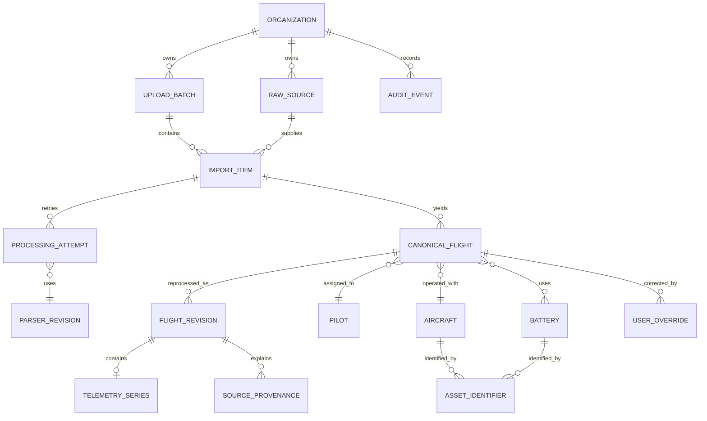
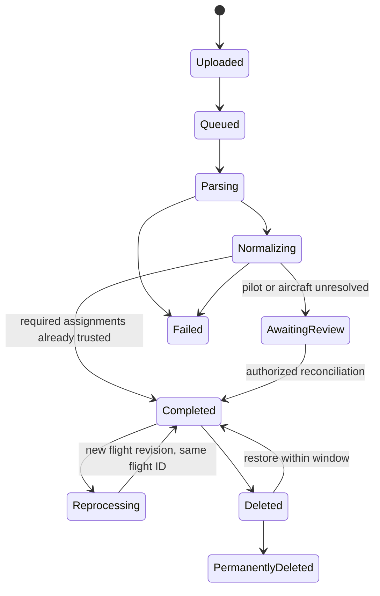

# Canonical domain model and provenance proof

Status: accepted Phase 0 proof
Last updated: 2026-07-15

## Purpose

This model proves that a versioned private parser result can become a source-independent flight revision without losing evidence, inventing missing assets, or overwriting human corrections. It implements the accepted direction in D-003, D-004, D-005, and D-006; it does not select a database schema or settle probable-duplicate scoring thresholds.

The vendor-neutral persistence contract is [`../../spikes/dji-parser/src/normalization/canonical.schema.json`](../../spikes/dji-parser/src/normalization/canonical.schema.json). Generic validation, fingerprinting, and lifecycle transitions live in [`../../spikes/dji-parser/src/normalization/canonical-model.mjs`](../../spikes/dji-parser/src/normalization/canonical-model.mjs); [`../../spikes/dji-parser/src/normalization/canonical-v1.mjs`](../../spikes/dji-parser/src/normalization/canonical-v1.mjs) is the first source adapter. Parser input and full canonical output are private application data. Ordinary serialization exposes structural counts, capability names, and the number of eligible fingerprints only.

## Resource relationships



One import item can yield zero, one, or multiple flight candidates. A candidate becomes an active canonical flight only after it has organization-owned pilot and aircraft assignments. Reprocessing adds a flight revision under the existing canonical flight identity; it does not create another flight.

## Generic canonical revision schema

`canonical_import_revision` version 1 is the private contract shared by every future parser adapter. It defines organization and import ownership, immutable source identity, parser revision, zero-or-more flight revisions, provenance-aware facts, assignment and identifier evidence, capabilities, SI telemetry, and exact-normalized duplicate evidence. It deliberately contains no DJI intermediate names or parser-specific field paths outside provenance values supplied by an adapter.

The executable validator additionally proves invariants that JSON Schema alone cannot express economically:

- flight organization, import-item, and processing-revision identities equal their parent revision;
- canonical flight IDs are unique within a revision;
- imported fact, asset-identifier, and telemetry provenance points to the same source and revision;
- telemetry sample counts equal the actual sample array length;
- every important fact retains imported evidence and an explicit effective-value rule;
- stored exact-normalized evidence recomputes from the canonical material exactly.

## Ownership and lifecycle

| Resource | Ownership boundary | Identity and revision rule | Deletion rule |
|---|---|---|---|
| Organization | Root tenant | Stable organization ID | Organization deletion removes all customer-owned descendants. |
| Upload batch | Organization | One request/grouping; never a cross-org aggregate | Removed with organization; ordinary item deletion may retain the batch summary while referenced. |
| Raw source | Organization | Content digest plus immutable object reference | Immutable while retained; delete after its final legitimate reference or organization deletion. |
| Import item | Organization and batch | One source item; retry does not replace it | Removed with batch/organization subject to the documented restoration window. |
| Processing attempt | Organization and import item | New ID for every retry | Customer payload is removed with its parent; sanitized operational evidence follows the logging policy. |
| Parser revision | Product-owned global reference | Immutable parser ID, version, source commit, and contract version | Retained as non-customer release evidence. |
| Canonical flight | Organization | Stable ID across reprocessing | Soft-deleted for restoration, then permanently removed with revisions and telemetry. |
| Flight revision | Organization and canonical flight | Immutable normalization result for one processing revision | Removed when the canonical flight is permanently deleted. |
| Telemetry series | Organization and flight revision | Versioned sample schema; never shared across organizations | Removed with its flight revision; downsampled derivatives follow the same lifecycle. |
| Pilot, aircraft, battery | Organization | Organization-scoped IDs; battery relationship is zero-to-many | Historical assignment remains until affected flights or the organization are permanently deleted. |
| Asset identifier | Organization and asset | Identifier type/value is evidence, not a global identity | Removed with the asset/organization; merge retains provenance and audit history. |
| User override | Organization and canonical flight | One active override per important field, with immutable history in audit events | Removed with the flight/organization according to audit deletion policy. |
| Audit event | Organization | Append-only event identity | Customer values are removed or de-identified when their owning data is permanently deleted. |

Every customer-data query, job, export, aggregate, and object reference must carry organization context. P0-05 will prove the persistence enforcement mechanism.

## Import and revision lifecycle



Zero-flight parser output completes the processing attempt with no canonical flight and retains the immutable source as import evidence. A later parser revision may create the first canonical flight from that zero-flight item. After canonical flights exist, reprocessing must reuse every retained flight identity and cannot run against a soft-deleted or permanently deleted flight. Multiple parser flights receive distinct canonical flight IDs but retain the same import-item and raw-source evidence.

The executable lifecycle proof keeps deletion state outside immutable flight revisions. Soft deletion starts an exact 30-day restoration window, immediately removes the flight from active totals, and retains its customer payload. Restoration before the deadline returns the prior `active` or `awaiting_review` state and its contribution to totals. At or after the deadline, permanent deletion clears revision payload and telemetry, retains only non-sensitive audit metadata, and makes the raw source eligible for deletion when no retained canonical flight still references it. Real database, object-storage, export, log, and backup deletion remain Phase 1 acceptance work.

## Canonical fact envelope

Every important field has the same provenance-aware shape:

```json
{
  "imported": {
    "value": 1200,
    "provenance": {
      "origin": "imported",
      "raw_source_id": "source-synthetic",
      "processing_revision_id": "revision-2",
      "intermediate_path": "flights[0].imported.declared_duration_ms",
      "source_value": 1200
    }
  },
  "derived": null,
  "user_override": {
    "value": 900,
    "provenance": {
      "origin": "user_override",
      "audit_event_id": "audit-synthetic"
    }
  },
  "base_preference": ["imported"],
  "effective": {
    "origin": "user_override",
    "value": 900
  }
}
```

The effective-value rule is:

1. An active `user_override` wins, including an intentional `null` value.
2. Otherwise use the first available value in that field's explicit `base_preference`.
3. If no preferred value exists, return `origin: unavailable` and `value: null`.

There is deliberately no global “derived beats imported” rule. A future derived field must declare its own preference based on documented semantics. A parser revision replaces imported and derived evidence in a new flight revision while the active override record is reapplied.

The initial executable mapping covers takeoff time, duration, distance, maximum height, horizontal and vertical speed, aircraft name/model, and source application platform/version. Telemetry uses one series-level provenance record plus a versioned field map rather than repeating identical provenance on every sample.

## Time interpretation

- A source RFC 3339 offset produces a reliable UTC instant. The original source string and offset remain in imported provenance.
- The canonical value is an ISO UTC instant.
- The display timezone is supplied by trusted organization context and records whether it came from the organization default or a later user correction.
- A source without a reliable offset is marked `assumed: true` and `review_required: true`; the original value is retained.
- A later timezone correction creates an audit event and override rather than replacing source evidence.

## Asset evidence and reconciliation

- Parser serials become organization-scoped identifier evidence with `asset_id: null` and `match_status: unresolved` until reconciliation.
- Aircraft model alone never creates or matches an aircraft.
- Missing battery identity is an empty battery-evidence list, not a fictional battery and not a zero identifier.
- Multiple distinct battery identifiers remain distinct list members.
- The uploader is not assumed to be the pilot.
- An `active` canonical flight requires both a pilot ID and aircraft ID plus separate assignment provenance for each. User selections cite an audit event and actor; automatic stable-identifier matches cite versioned match evidence. Otherwise the candidate remains `awaiting_review`.

## Capabilities and missing values

Canonical capability contract version 1 maps parser capability names to:

- `telemetry.altitude`
- `telemetry.attitude`
- `telemetry.battery`
- `telemetry.gps`
- `telemetry.position`
- `telemetry.signal`
- `telemetry.velocity`

Capabilities describe fields actually present in normalized data. Missing scalar or sample values remain `null`; zero is retained only when the source actually reports zero. Manual flights use an empty telemetry-capability list.

## Exact-normalized fingerprint evidence

Duplicate classification remains separate from normalization:

| Class | Evidence | Automatic effect |
|---|---|---|
| Exact file | Same organization and immutable source digest | May reuse/skip the identical import according to batch behavior. |
| Exact normalized | Same versioned normalized fingerprint and explainable match fields | May avoid a second canonical flight while retaining the import result. |
| Probable | Versioned reasons such as time, track, aircraft, or duration similarity | Never discard automatically; create a reversible review item. |

Battery absence is never positive match evidence. Fingerprint versions and reasons must be retained.

`exact-normalized-v1` is a SHA-256 digest over deterministic JSON containing only normalized operational material:

- imported canonical takeoff instant and duration;
- sorted stable aircraft identifiers and any present battery identifiers;
- normalized distance, height, and speed facts;
- the versioned capability names; and
- the versioned telemetry samples in elapsed-time order.

It excludes organization, source, import, attempt, revision, parser, provenance, assignment, canonical-flight, and audit identifiers, plus user overrides. Therefore identical normalized output from a later parser revision retains the same fingerprint, and a human correction cannot turn two different source results into an exact duplicate. Eligibility requires at least one stable aircraft identifier, a reliable canonical takeoff instant, and a non-negative integral duration. Battery identity is included when present but is never required; missing batteries therefore supply no positive match reason. Changing normalized telemetry or another included fact changes the digest.

Stored evidence includes the algorithm, fingerprint version, eligibility status, included match-field names, and missing requirements. Exact classification requires the same organization, version, digest, and explainable stable-identifier/timing evidence. Probable duplicate scoring remains a separate, review-only future proof.

## Draft Phase 1A API resources

All routes are versioned and organization-scoped; authorization is rechecked on every operation.

| Method and resource | Purpose |
|---|---|
| `POST /v1/organizations/{organizationId}/import-batches` | Create upload intent and item records. |
| `GET /v1/organizations/{organizationId}/import-batches/{batchId}` | Read batch and per-item progress/outcome. |
| `GET /v1/organizations/{organizationId}/import-items/{itemId}` | Read parser, normalization, review, or failure evidence. |
| `GET /v1/organizations/{organizationId}/flights/{flightId}` | Read effective facts, provenance summaries, assignments, and capabilities. |
| `GET /v1/organizations/{organizationId}/flights/{flightId}/track` | Read authorized canonical track data with bounded resolution. |
| `PATCH /v1/organizations/{organizationId}/flights/{flightId}/overrides/{field}` | Create or replace an audited field override. |
| `DELETE /v1/organizations/{organizationId}/flights/{flightId}/overrides/{field}` | Remove the active override and reveal the current base value. |

Private parser/intermediate structures are never returned by these resources. Public response schemas will be defined with the walking-skeleton API and must preserve the imported/derived/override distinction where the product exposes provenance.

## Executable evidence and remaining work

Source-free tests currently prove:

- the adapter output satisfies a vendor-neutral canonical revision contract;
- imported fact provenance and UTC conversion;
- unavailable values remain `null`;
- private canonical serialization does not reveal identifiers or telemetry;
- one import item can yield multiple distinct flight identities;
- multi-battery and missing-battery evidence remain truthful;
- an active override survives a simulated parser revision under the same canonical flight ID;
- exact-normalized fingerprints are deterministic across parser/provenance/override changes and change with normalized telemetry;
- fingerprint eligibility requires stable aircraft and timing evidence but not a battery identifier;
- reprocessing updates the retained revision and totals without creating a second flight identity;
- deletion excludes active totals, restoration reinstates them, and grace expiry purges customer payload;
- zero-flight processing completes without a fictional flight and may later produce the first flight on reprocessing;
- raw intermediate objects, invalid override values, cross-organization overrides, invalid active assignments, and identity-count mismatches fail closed.

P0-04 now has its generic schema, exact-normalized fingerprint, lifecycle-transition proof, provenance model, and representative adapter evidence. P0-05 should translate this ownership and identity contract into database constraints and organization-enforced access; P0-06 should benchmark the versioned telemetry shape. Object-storage and backup deletion still require their later production-shaped proofs.
