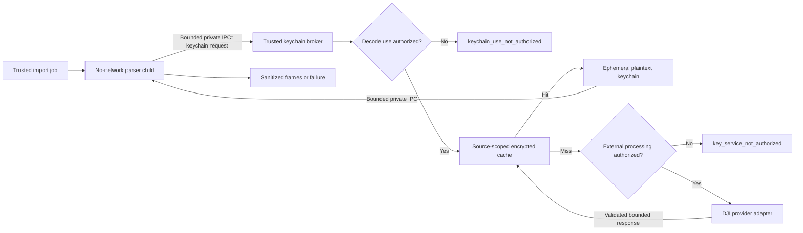

# DJI keychain trust boundary

Status: proposed; controlled one-shot runner dry-run proven, live disclosure blocked by host policy
Last updated: 2026-07-14

## Decision summary

DJI API credentials and network access belong to a trusted keychain broker, never to the parser process. Parsing remains in a no-network, resource-limited child. The broker separately enforces authorization to decode a log and authorization to transmit a keychain request to DJI.

A production-shaped DJI provider adapter is wired only into an explicit Phase 0 one-shot runner, not an application or worker runtime. The runner defaults to no-network dry-run mode, requires an individually authorized fixture plus `--allow-dji-request` for live mode, reads a temporary ignored development credential only in the broker, and destroys its encrypted in-memory cache before exit. No DJI API call has been made: the first live execution was rejected by the host's external-disclosure policy before the runner process started.

## Trust flow

The raw keychain request, API credential, keychain response, and plaintext cached value must never appear in ordinary logs, job payloads, audit payloads, webhooks, customer-visible errors, or public API representations.

## Separate authorization decisions

### Keychain-use authorization

Allows Drone.Works to use a previously obtained keychain to decode this source. If false:

- do not read the cache;
- do not construct a keychain request;
- do not call a provider;
- return `keychain_use_not_authorized`;
- start or complete source/cache deletion according to the revocation workflow.

### External-service-processing authorization

Allows the keychain request payload to be transmitted to the approved DJI endpoint under the organization's notices and consent. If false:

- an authorized existing cache entry may still be used;
- a cache miss returns `key_service_not_authorized`;
- the request factory is not invoked;
- the provider is not called.

This distinction supports offline reuse without silently expanding permission to contact DJI again.

## Broker states

| State | Meaning | Retriable? |
|---|---|---:|
| `not_required` | Log version does not require a keychain | No action needed |
| `keychain_use_not_authorized` | Decode use is not authorized | Only after authorization changes |
| `cache_hit` | Valid encrypted cache entry resolved locally | No external work |
| `fetched` | Provider returned a valid response and cache write succeeded | Completed |
| `key_service_not_authorized` | Cache miss and external processing is not authorized | Only after authorization changes |
| `key_service_unavailable` | Approved provider could not complete the request | Yes, with bounded retry |
| `key_service_rate_limited` | Approved provider returned HTTP 429 | Yes, under a separate bounded retry policy |
| `key_rejected` | Provider rejected the request/key/account | Not automatically without diagnosis |
| `invalid_keychain_request` | Parser-produced request failed bounds/schema validation | No automatic external retry |
| `invalid_keychain_response` | Provider response failed bounds/schema validation | No cache write; alert and investigate |

No state includes raw request or response values.

## Request and response validation

Before provider access, the broker checks:

- request version and department are bounded integers;
- keychain groups and feature points are non-empty and bounded;
- feature-point names belong to the parser's declared set;
- ciphertext fields are canonical bounded base64;
- total serialized request size is at most 256 KiB.

Before cache or parser access, the broker checks:

- response groups and feature points are non-empty and bounded;
- feature-point names are recognized;
- AES keys decode to 16–64 bytes;
- AES IVs decode to 12–32 bytes.

The limits are defensive spike values and must be checked against authorized real responses before acceptance.

## Credential handling

The provider adapter must:

- receive the DJI API credential from a managed secret store at runtime;
- keep the secret out of source, images, environment dumps, job payloads, and child processes;
- send only to an allowlisted TLS endpoint;
- disable redirects to unapproved hosts;
- use bounded connect/request timeouts and response sizes;
- redact authorization headers and payloads from logs and traces;
- distinguish network outage, authentication rejection, rate limiting, and invalid response;
- support credential rotation without reprocessing every cached source.

The spike adapter uses an exact endpoint allowlist, HTTPS-only external URLs, manual redirect handling, an injected runtime credential provider, a 5-second default end-to-end timeout, and a 256 KiB response limit. It models `POST https://dev.dji.com/openapi/v1/flight-records/keychains`, the `Api-Key` header, and the documented `{ "data": ... }` response envelope. Cleartext HTTP is accepted only for an explicitly enabled loopback test server. External HTTPS remains disabled unless the caller supplies a separate authorization flag.

For the Phase 0 one-shot runner only, the credential callback reads `DJI_FLIGHT_RECORD_API_KEY` directly from the ignored repository-root `.env.local`. The file is not loaded into the process environment and the restricted parser child receives the existing minimal environment. This temporary development path does not satisfy the production managed-secret-store gate.

No personal developer API key may become an undocumented production dependency.

## Cache model

Phase 1 should store one encrypted keychain entry per organization-owned raw source and parser/key-format context. Do not share physical keychain entries across organizations initially, even when raw hashes match.

Required metadata:

- `org_id`
- `raw_source_id`
- parser identifier/version
- log/key format version
- envelope-encryption key reference/version
- IV/nonce, authentication tag, and ciphertext
- creation and last-use timestamps
- provider identifier
- authorization/notice version that permitted retrieval
- deletion state and deletion timestamp

Plaintext keychains are encrypted with authenticated encryption. Additional authenticated data binds ciphertext to organization, source, parser, and log version so entries cannot be swapped between contexts.

The spike uses AES-256-GCM with an injected in-memory 32-byte key. Production must use envelope encryption backed by a managed KMS/HSM or equivalent secret-management boundary. JavaScript buffer zeroing is best-effort and does not guarantee that all runtime copies disappear from memory.

## Deletion and revocation

- Revoking decode authorization deletes all cache entries for the organization/source.
- Permanently deleting the raw source deletes its keychain entries in the same deletion workflow.
- Organization deletion deletes every keychain entry before completion is acknowledged.
- Backups follow the documented maximum retention window.
- Provider-side deletion or retention claims must be documented separately; local deletion does not imply DJI deleted its service logs.
- Deletion events record identifiers and outcome, never plaintext keys or feature points.

## Parser IPC boundary

The intended parser protocol has two private operations:

1. `build_keychain_request`: the no-network child reads the source and returns a bounded request through a private pipe; the supervisor validates it and exposes only sanitized metadata to ordinary callers.
2. `decode_with_keychain`: the broker passes the resolved plaintext keychain through bounded standard input to a fresh parser child; the child returns a sanitized decode summary or a structured failure.

Keychain payloads are not placed in durable queue messages, environment variables, command-line arguments, or temporary files. The supervisor bounds the serialized input to 256 KiB, clears its retained input buffer after the child closes, and exposes only allowlisted output. JavaScript buffer clearing is best-effort because runtime copies cannot be guaranteed absent.

The spike implements both operations. The request is held behind a non-serializing `PrivateKeychainRequest` accessor for the broker, while ordinary JSON contains only validation metadata. The decode path validates keychains before opening a fixture or spawning a child, transfers them through standard input, and starts a fresh no-network child for each operation.

## Mock evidence

The Phase 0 spike includes:

- disabled and mock provider adapters;
- request and response bounds validation;
- a broker with separate authorization gates;
- an AES-256-GCM in-memory cache bound by authenticated context;
- sanitized resolution objects whose JSON form never contains keys/IVs;
- source and organization deletion operations;
- private request extraction and bounded standard-input keychain delivery;
- allowlisted decode summaries that exclude request values, keys, IVs, coordinates, and unexpected worker fields.
- a disabled-by-default DJI provider adapter tested only against loopback HTTP.

Nine broker/cache tests prove:

- pre-v13 bypass;
- decode-use denial;
- no request construction or provider call without external authorization;
- fetch, validation, encryption, and sanitized return;
- offline cache hit without external permission;
- invalid request rejection before provider access;
- outage and rejection classification;
- invalid response rejection without cache write;
- source revocation and organization deletion.

Five parser IPC tests additionally prove private request serialization, invalid-request rejection, absence of key material from arguments/environment/result output, validation before child spawn, and bounded sensitive input.

Twelve provider scenarios prove exact endpoint allowlisting, HTTPS enforcement, the external-network kill switch, pre-credential request validation, runtime credential delivery, request shape, redirect rejection, authentication and rate-limit classification, response-size and JSON validation, end-to-end timeout, and credential redaction. Controlled-runner and wire-identifier tests additionally prove default dry-run behavior, authorization rejection before parsing, broker-to-child secret isolation, cache destruction, credential-file parsing, and the finite DJI feature-point allowlist. The integration scenarios use a local mock server and never resolve or contact a DJI host.

The real first fixture produced one bounded dry-run request containing one group and nine allowlisted feature points. The parent serialized only counts and sizes. A requested live execution was denied by the host before process creation because fixture-derived private data would have left the workspace, so it produced no provider or decode result.

## Acceptance gates before a real request

- [x] Repository owner confirms authority to accept the DJI API agreement for Drone.Works.
- [ ] A Drone.Works Open API application/key exists in an accepted secret store. A temporary ignored development key exists but is not a production secret-store decision.
- [ ] Qualified review accepts the intended commercial use and current DJI terms.
- [ ] User notice and consent wording is approved and versioned.
- [ ] The exact endpoint, redirect policy, request fields, retention, and regional processing are documented.
- [x] Private request/keychain IPC is implemented and tested.
- [x] The real provider adapter passes mock-server tests without contacting DJI.
- [ ] Cache schema, KMS strategy, RLS, backup, rotation, and deletion behavior are accepted.
- [ ] The three local fixtures receive explicit authorization for the real request. The first fixture is authorized; the other two and the derivative remain unauthorized.

Until every applicable production gate passes, `DisabledKeychainProvider` remains the only permitted application/worker provider. The explicit one-shot research runner is the sole narrow exception: one fixture, one process, no durable keychain, exact endpoint, fail-closed manifest authorization, and sanitized output.
