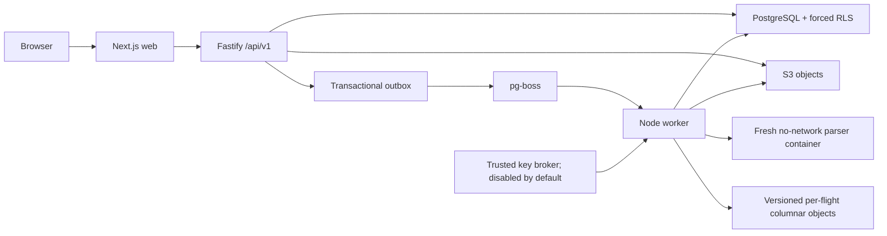

# Phase 1A system architecture

Status: accepted Phase 0 baseline
Last updated: 2026-07-16

## System shape

Drone.Works is a modular TypeScript application with three independently
runnable processes and one isolated native parser:

The web client never writes customer domain state through private server
actions. It calls the same versioned API exposed to future integrations. The
API and worker share contracts and domain packages but do not share process
memory.

## Selected stack

| Concern | Selection | Why |
|---|---|---|
| Repository | pnpm TypeScript monorepo | One primary language and reproducible package graph. |
| Web | Next.js App Router as a client of `/api/v1/` | Strong UI ecosystem without making the framework the domain boundary. |
| API | Fastify plus JSON Schema/TypeBox contracts | Runtime validation, generated OpenAPI, and a replaceable HTTP layer. |
| Worker/jobs | Node.js worker, PostgreSQL outbox, pg-boss | Atomic enqueue, durable retry, cancellation, and observable queue age without another datastore. |
| Database | Managed PostgreSQL; `pg` plus reviewed SQL initially | The proven forced-RLS and migration contract stays visible. Drizzle is deferred until it proves it cannot rewrite security objects. |
| Authentication | Better Auth core with PostgreSQL | Self-hosted identity behind the D-013 provider-neutral boundary. |
| Raw/export/telemetry objects | Amazon S3 through an application-owned versioned-object adapter | Immutable conditional writes, exact versions, signed reads, lifecycle controls, and portable S3 semantics. |
| Telemetry | D-008 versioned per-flight columnar objects plus PostgreSQL metadata | The complete 100,000-flight benchmark passed. |
| Parser | D-009 native Rust CLI in a fresh Linux OCI container | Approximately 70 MB observed peak RSS with a hard no-network boundary and independent failure. |
| Maps | MapLibre GL JS; provider selected later | The renderer is decoupled from private track data and the tile provider. |
| Hosting | AWS region selected through the D-014 readiness gate | UAE `me-central-1` is the preferred customer-data target; Frankfurt `eu-central-1` is permitted for synthetic-only staging while UAE is not operationally suitable. Region remains an infrastructure input. |

## Initial AWS topology

- The target region is an explicit IaC input. Required regional services and
  current AWS health are checked before provisioning; temporary Frankfurt
  staging never implies approval to place customer data there.
- A production AWS account is separate from a non-production account. Each has
  distinct VPCs, buckets, databases, KMS keys, secrets, DNS names, and IAM roles.
- One replaceable Graviton EC2 application host runs pinned OCI images for the
  reverse proxy, web, API, worker, and outbox dispatcher. This is an intentional
  private-beta single point with a four-hour internal RTO, not an availability
  claim.
- The parser runs as an unprivileged rootless container with no network,
  read-only inputs, bounded temporary storage, dropped capabilities,
  `no-new-privileges`, and CPU/memory/PID/time/output limits. It receives no host
  IAM credential or database socket.
- RDS PostgreSQL is private, encrypted, Single-AZ for beta, and sized from load
  evidence. Multi-AZ becomes mandatory before an uptime commitment or when a
  single-AZ recovery drill cannot meet the four-hour RTO.
- S3 buckets have Block Public Access, versioning, default encryption, TLS-only
  policies, an application prefix policy, incomplete-multipart cleanup, and no
  cross-region replication in Phase 1A. Customer deletion enumerates and
  permanently deletes every version rather than creating a delete marker.
- ECR holds signed, digest-pinned images. Systems Manager is the ordinary host
  administration path; inbound SSH is disabled.
- CloudWatch receives bounded structured logs, metrics, alarms, and deployment
  events. Application traces are sampled and payload-free.
- The DJI provider path remains disabled. Enabling it requires every D-012 legal,
  consent, secret, egress, cache, and deletion gate.

AWS documents that an account is an isolation boundary and that separate
accounts reduce the blast radius between workloads. S3 documents that a simple
delete in a versioned bucket only creates a delete marker; permanent deletion
therefore always supplies each version ID. See the official
[account guidance](https://docs.aws.amazon.com/prescriptive-guidance/latest/security-reference-architecture/dedicated-accounts.html)
and [S3 version-deletion behavior](https://docs.aws.amazon.com/AmazonS3/latest/userguide/DeletingObjectVersions.html).

## Component ownership and exit

| Component | Operational owner | Primary failure mode | Exit cost / replacement boundary |
|---|---|---|---|
| Web/API/worker images | Drone.Works engineering | Bad deploy or exhausted host | Rebuild OCI images on another container host; no domain rewrite. |
| PostgreSQL/RDS | Engineering; AWS manages service hardware | unavailable instance, bad migration, pool exhaustion | Standard PostgreSQL dump/restore plus reviewed SQL; RLS contract travels with migrations. |
| pg-boss/outbox | Engineering | stuck/duplicate/abandoned job | Job payload/version and handler boundaries permit another queue; domain handlers remain idempotent. |
| Better Auth | Engineering | login outage, security advisory, migration error | Identity adapter exposes only user/session IDs; export auth rows and replace the provider without changing memberships. |
| S3 | Engineering; AWS manages durability | denied request, throttling, region outage, incomplete deletion | Object keys, checksums, version IDs, and adapter contract map to another S3-compatible store. |
| Parser | Engineering | malformed input, resource exhaustion, unsupported version | Replace the CLI behind the versioned intermediate contract. |
| CloudWatch | Engineering | missing/delayed telemetry or excess log cost | OpenTelemetry-compatible application signals and structured JSON can move to another backend. |
| Email and map tiles | Engineering | provider outage or quota | Application-owned adapters; providers remain Phase 1A procurement tasks. |

## Phase 1A vertical flow

1. Better Auth establishes a verified user session. The API receives only the
   user ID; route organization, canonical membership, role checks, and RLS
   authorize every operation.
2. An upload declaration creates an organization-owned import item and a
   derived S3 key. The client or API performs a checksum-bound conditional put;
   completion is accepted only after `HEAD` confirms the version and digest.
3. Domain state and a payload-free outbox row commit together. The dispatcher
   sends one stable pg-boss job ID.
4. The worker reloads organization context through forced RLS, fetches one exact
   object version, and starts a fresh parser container.
5. The trusted worker validates the private intermediate, normalizes it,
   persists canonical/provenance rows, writes a versioned telemetry object, and
   commits processing state idempotently.
6. The API returns summary data and short-lived, exact-version downloads only
   after current authorization.

## Explicit Phase 1A boundaries

Kubernetes, Redis, public webhooks, public API keys, billing automation,
cross-region failover, a data warehouse, and a time-series database are not
required. The single application host and Single-AZ database are private-beta
tradeoffs with tested rebuild/restore paths, not the long-term availability
architecture.
