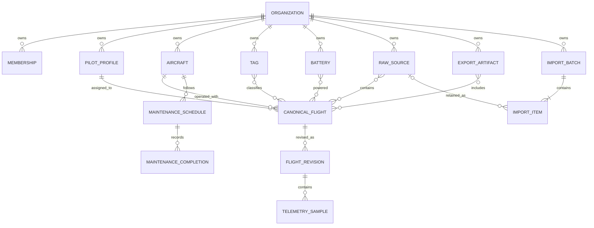

# Organization isolation

Status: draft Phase 0 proof
Last updated: 2026-07-16

## Purpose

P0-05 must make cross-organization access difficult to express and easy to test. The first executable slice translates the generic ownership and identity rules from [`DOMAIN-MODEL.md`](DOMAIN-MODEL.md) into PostgreSQL constraints, forced row-level security (RLS), and an organization-required repository boundary.

The native PostgreSQL spike lives in [`../../spikes/postgres-rls/`](../../spikes/postgres-rls/). It validates PostgreSQL as a viable relational isolation mechanism and exercises pg-boss as the provisional real-queue candidate without yet accepting D-002 or selecting Drizzle, pg-boss, a database host, or a production administration model.

## Relational ownership slice

The proof includes the smallest connected resource graph needed to exercise the canonical model:



Every child has a non-null `organization_id`. Parent keys and foreign keys include that organization identifier, so a Beta flight or maintenance record cannot reference an Alpha pilot, aircraft, schedule, battery, tag, import batch, raw source, revision, or telemetry parent even if an application mutation supplies exact resource IDs. Raw-source and export-artifact references are also organization-owned RLS rows; their physical object keys are derived only after authorization and are not accepted as client input. Imported and user-added flight tag/battery links retain distinct origins. This relational slice persists generic flight facts and capability names; source-specific parser structures remain outside it.

The full canonical schema still validates provenance, effective facts, sample counts, and fingerprint integrity before persistence. This spike does not duplicate that complete validator as database constraints.

## Roles and RLS

The migration defines six deliberately separate roles:

| Role | Use | Relevant properties |
|---|---|---|
| `droneworks_migrator` | Owns the schema and tables | `NOLOGIN`, `NOINHERIT`, non-superuser, `NOBYPASSRLS` |
| `droneworks_migration_runner` | Applies checksum-pinned reviewed migrations | login, `NOINHERIT`, non-superuser, `NOBYPASSRLS`; may explicitly `SET ROLE` only to `droneworks_migrator` |
| `droneworks_migration_auditor` | Owns the operational migration ledger and its narrow functions | `NOLOGIN`, `NOINHERIT`, non-superuser, `NOBYPASSRLS`; no membership granted to the runner or schema owner |
| `droneworks_app` | Ordinary repository, job, and export access | login, `NOINHERIT`, non-owner, non-superuser, `NOBYPASSRLS` |
| `droneworks_queue` | Owns only the pg-boss infrastructure schema | login, `NOINHERIT`, non-superuser, `NOBYPASSRLS`; no customer-table grants |
| `droneworks_deletion_worker` | Executes only the reviewed permanent-organization-deletion function and reads its receipt | login, `NOINHERIT`, non-owner, non-superuser, `NOBYPASSRLS`; no direct customer or receipt-table grants |

Every customer-owned table enables RLS and uses `FORCE ROW LEVEL SECURITY`, including the organization root. One policy permits a row only when its organization matches the transaction's `app.organization_id`; missing or empty context resolves to no organization and therefore no rows. The same expression is used for `USING` and `WITH CHECK`, so writes cannot move or create rows outside the selected organization.

The bootstrap superuser exists only inside the temporary test cluster to create roles, apply the baseline, seed synthetic evidence, and assert the explicit bypass case. It is not an ordinary application or proposed production maintenance path.

## Privileged migration boundary

The candidate deployment path has no login for the customer-schema owner. A non-inheriting migration runner can assume that owner only inside the transaction that applies an exact repository migration whose SHA-256 digest is pinned in code. A transaction advisory lock serializes migration attempts. The same transaction records the migration ID, digest, time, session identity, and application name; equivalent replay is a no-op, changed bytes fail checksum validation, and reuse of an applied ID with another reviewed digest fails as a conflict.

The operational ledger lives outside the customer schema and is owned by a separate no-login audit role. The runner has execute access only to security-definer read/append functions and has no direct table privileges. The same owner protects a permanent-deletion receipt table. The deletion worker can read a receipt only through a narrow function; only the migrator-owned deletion function can invoke the receipt writer, and neither identity has direct table access. Application and queue roles cannot access the operational schema. Operational rows contain migration evidence or an opaque organization reference, deletion/request times, configured backup-retention deadline, and raw/export object counts—never organization names, member identities, notes, coordinates, object keys, or other customer payload.

The runner snapshots a deterministic customer-isolation contract around every reviewed migration. The contract covers every customer table's owner, grants, RLS and `FORCE RLS` flags, and policy expressions. The audit-index and organization-administration migrations are checksum-pinned, ledger-recorded, and leave the isolation-contract digest unchanged. Later reviewed migrations explicitly expand the contract by exactly the declared six tag/battery/import tables, one organization-export request table, and two maintenance tables. Two permanent-deletion migrations declare exact privilege tightening: ordinary-app `DELETE` is removed first from the organization root and then from canonical flights and raw sources without changing those tables' owners, policies, or forced-RLS state. The runner rejects unexpected table additions or changes and requires every declared added table to retain migrator ownership plus enabled and forced RLS. In this candidate model, routine privileged maintenance must ship as a reviewed migration; there is no separate standing ad-hoc DML role. Production credential delivery, CI identity, externally retained database audit logs, and emergency procedure remain deployment/operations decisions rather than authority granted to ordinary processes.

## Pooled-connection contract

Organization context is always transaction-local:

```text
pool.connect()
  -> BEGIN
  -> set_config('app.organization_id', authorizedOrganizationId, true)
  -> repository queries
  -> COMMIT or ROLLBACK
  -> release connection
```

The third argument to `set_config` makes the setting local to the transaction. The executable pool test fixes the pool at one connection, records its backend PID, runs Alpha, releases the connection, proves a contextless read on the same PID returns zero rows, and then proves Beta sees only Beta data on that same PID.

Repository methods do not accept an optional organization filter. They can run only inside `withOrganization()`, which rejects missing/invalid context before acquiring a client. Background job enqueue and execution require an exact versioned organization/domain reference: flight refresh uses `{ schemaVersion, organizationId, flightId }`, while complete export uses `{ schemaVersion, organizationId, exportRequestId }`. An ID alone, a manifest, or additional private material is invalid. The queue role owns only pg-boss infrastructure, while the worker resolves domain rows through the ordinary RLS application pool. The organization passed here must already have been authorized by the application membership/role layer.

Permanent deletion uses a separate one-connection deletion pool and the same transaction-local setting, applied inside reviewed security-definer functions before any customer lookup or delete. Organization deletion locks and matches the current `pending_deletion` timestamp, enforces the 30-day grace boundary, deletes every child table in explicit dependency order, deletes the root, and appends the operational receipt atomically. Flight deletion locks and matches the soft-deletion timestamp, applies the same grace boundary, removes canonical payload and telemetry, and deletes only raw sources with no other flight reference. `COMMIT` clears context before that backend is reused. Ordinary app, queue, and deletion-worker SQL cannot directly delete these roots; only the narrow functions are executable by the deletion worker.

## Executable evidence

The integration suite currently proves, with synthetic Alpha and Beta records:

- ordinary-role attributes and table ownership;
- explicit reviewed-migration elevation, independent ledger ownership, checksum/replay controls, and declared isolation-contract preservation or expansion;
- RLS enabled and forced on all twenty-three tables;
- missing-context read and write denial;
- direct-ID, join, aggregate, export, and mutation isolation;
- cross-organization relationship rejection through composite foreign keys;
- transaction-safe reuse of the same pooled backend;
- fail-closed job lookup, durable payload validation before enqueue and execution, and real queue retry isolation;
- versioned HTTP flight reads and download issuance with membership, role, pilot ownership, and organization-policy checks;
- versioned flight creation and mutation with idempotency, audit redaction, reversible deletion, role checks, and uniform IDOR denial;
- versioned organization administration with owner/admin member and settings operations, owner-only ownership transfer and deletion requests, historical pilot retention, and uniform IDOR denial;
- versioned tag, battery, and upload/import operations with pilot-own versus manager roles, idempotency, payload-redacted audits, uploader scope, composite ownership, and uniform IDOR denial;
- manager-only complete organization-export requests with immutable RLS data snapshots, deterministic JSON/CSV bundle bytes, idempotent artifact finalization, strict queue references, retry recovery, pooled clearing, and uniform IDOR denial;
- maintenance schedules and append-only completions with manager-only creation, all-member reads, derived active-flight usage, baseline reset, payload-redacted audit, pooled clearing, and uniform IDOR denial;
- permanent organization deletion after grace through a dedicated no-direct-table worker, explicit twenty-two-child dependency order, one atomic non-customer receipt, strict timestamped queue references, post-commit retry idempotency, pooled clearing, and cross-organization/stale-reference denial;
- permanent flight deletion after grace with canonical payload/telemetry removal, exclusive raw-source deletion, shared-source retention, payload-redacted action evidence, strict timestamped queue references, retry idempotency, pooled clearing, and cross-organization/stale-reference denial;
- imported pilot/aircraft assignments retained as a separate baseline while an organization-owned override row supplies the effective reassignment;
- organization-derived raw-source/export keys, bounded link lifetime, uniform denial, and membership-revocation checks; and
- forced RLS behavior for the table owner, alongside explicit superuser bypass evidence.

Run it with native PostgreSQL 18:

```sh
npm --prefix spikes/postgres-rls test
```

The runner creates and destroys an ephemeral socket-only cluster. It does not start a persistent service or use Docker.

## Background queue boundary

The pg-boss proof keeps queue infrastructure and customer data permissions separate. A dedicated `droneworks_queue` role owns only the `droneworks_jobs` schema. Durable flight-refresh jobs contain only a payload version, organization ID, and flight ID. Durable complete-export jobs similarly contain only a payload version, organization ID, and export-request ID; the manifest stays in the RLS request row. Permanent-organization-deletion jobs contain only a payload version, organization ID, and canonical request timestamp. Permanent-flight-deletion jobs add the flight ID and bind it to the canonical soft-deletion timestamp. These timestamps prevent a cancellation/restoration and later deletion from being confused with a stale job. Raw sources, object keys, coordinates, parser results, cached secrets, manifests, and user authorization material are rejected as unexpected job fields.

The flight-refresh test fails an Alpha job once, lets pg-boss place the same job into retry state, and then succeeds it. Both attempts load only Alpha through the one-connection RLS pool. A Beta-scoped job containing the Alpha flight ID completes with `not_found` and never reaches the domain handler. The export test applies the same execution lookup to an Alpha export request, proves the durable payload omits its manifest, and hides that request when the queued organization is Beta. Its artifact adapter then fails once; the database transaction rolls back to `queued`, pg-boss retries the same safe reference, and deterministic generation reaches `ready` with one stored object and one completion audit. Re-execution after queue completion returns the existing artifact without another write. Both deletion tests fail the worker after the database transaction commits. Organization retry finds zero customer rows plus one receipt; flight retry finds the payload-redacted completion action. Each returns `already_deleted` without repeating or altering the effect. Malformed ID-only jobs inserted by bypassing adapters are rejected during execution. This proves the organization contract survives durable storage, connection reuse, retry, and idempotent export/deletion effects; atomic API-to-queue dispatch and worker termination/observability remain later D-011 obligations.

## Permanent organization deletion boundary

Owner-only API operations still request and cancel the reversible `pending_deletion` state. Completion is not exposed as a user-callable API operation. A dedicated deletion-worker login has no direct customer-table or receipt-table privileges and cannot assume the schema or receipt owner. The reviewed migration removes ordinary-app `DELETE` from the organization root and grants the worker only `droneworks.permanently_delete_organization(...)` plus receipt lookup.

The durable reference binds execution to the exact request timestamp. The function returns one `not_eligible` result for active, cancelled, missing, cross-organization/stale, or younger-than-30-day requests. For an eligible request it applies transaction-local RLS context, locks the root, counts logical raw/export objects for provider reconciliation, deletes all twenty-two child table types in explicit foreign-key order, deletes the root, and records completion in the separately owned operational schema within the same transaction. A synthetic fixture places one row in every customer table; all twenty-three counts become zero. The receipt retains only the opaque organization reference, request/completion times, the worker-configured maximum backup-retention deadline, two object counts, and completing system role.

A failure after commit leaves the domain effect and receipt durable while pg-boss retries. The next attempt finds the receipt before looking for a customer row and returns the original timestamps/counts even if worker configuration changed. Transaction-local context is empty on the reused deletion backend. This proves active-database deletion and retry semantics only: object provider deletion must precede the final database transaction in a production orchestrator, while external logs, cached secrets, backups, deletion verification, and the production maximum backup-retention value remain open.

## Permanent flight deletion boundary

The same dedicated worker receives only `{ schemaVersion, organizationId, flightId, deletedAt }`. The reviewed function applies transaction-local RLS, returns one `not_eligible` result for active, restored, missing, cross-organization, stale-timestamp, or younger-than-30-day flights, and locks the matching deleted flight. It identifies raw sources linked only to that flight, clears those source references from retained import history, deletes the canonical flight so revisions, telemetry, associations, and overrides cascade, and then deletes only the exclusive raw-source rows. A source linked to another retained flight and its import reference survive.

The completion event retains only the opaque flight reference, canonical UTC deletion time, removed-raw-source count, system actor, and changed field name. Notes, location, normalized facts, telemetry, raw object identifiers, and filenames are absent. A synthetic post-commit failure causes pg-boss retry to return the same action evidence without repeating deletion, and the reused deletion connection has empty context. This proves relational eligibility and reference handling; provider object deletion still must complete before relational source removal in a production orchestrator.

## Versioned API authorization boundary

The proof exposes real loopback HTTP operations under `/api/v1/` while keeping authentication behind an injected identity adapter. The harness therefore tests API authorization independently of the unresolved Phase 1 session provider and does not select a web framework. Client input cannot supply a user ID; only the authenticated identity reaches the membership query.

All four Phase 1 roles may view active flights in their selected organization. Owner and admin identities may download organization raw-source and export artifacts. Pilot identities may download an artifact only when organization policy permits it and every flight linked to that artifact is assigned to the membership's linked pilot profile; a mixed-pilot raw source or export is denied in full. Viewers cannot download either type. Missing membership, insufficient role, another pilot's artifact, mixed ownership, disabled pilot policy, cross-organization exact IDs, and unknown IDs return the same RFC 9457 `404` problem without signer access.

The mutation slice requires complete manual-flight timing, timezone, duration, and location-text fields and persists no invented telemetry or raw source. Owner, admin, and pilot roles may create; viewers may not. Creation requires an idempotency key scoped to organization, authenticated user, and operation. Equivalent replay returns the original `201` result without a second flight or audit event, while different input under the same key returns `409`.

Owner/admin may edit notes, reassign assets, delete, and restore; pilots may edit notes only while the flight is assigned to their linked pilot profile; viewers cannot mutate. Reassignment is constrained to organization-visible pilot and aircraft rows. Soft deletion preserves the prior active/review state and excludes the flight from lists and derived totals. Restore succeeds only when fewer than 30 days have elapsed. Every successful mutation writes an organization-owned audit event with actor, action, time, resource, and changed field names; note content and other customer payload are not copied into audit metadata.

The administration slice exposes manager-only membership listing and idempotent `PUT`/delete operations plus partial organization-settings updates. Owner/admin identities may manage non-owner memberships and settings; pilots, viewers, missing members, and cross-organization identities receive the same not-found response. The ordinary member endpoint cannot grant, demote, or remove an owner. Removing a linked member clears only the pilot profile's login link and preserves the historical pilot and flights.

Ownership transfer is a separate owner-only transaction: it locks both memberships, demotes the current owner, promotes an existing organization member, and relies on a partial unique index to prevent two owners. Organization deletion is likewise owner-only and records a reversible `pending_deletion` request timestamp; cancellation restores `active` state. Repeated equivalent requests do not create duplicate audit events. Administration audits retain action/resource/changed-field information but omit organization setting values.

All members may list organization tag and battery definitions. Owners/admins may update battery records and add or remove user-origin battery links on active flights; imported battery links remain immutable through that endpoint. Owners/admins may likewise add or remove user-origin flight tags, while a pilot may do so only for a flight currently assigned to the membership's linked pilot profile. Viewers cannot mutate either resource. Exact IDs from another organization, missing membership, wrong role, and unknown IDs return the same not-found response.

Owner, admin, and pilot identities may create an upload/import batch with one item per declared file; viewers may not. Creation requires organization/user/operation-scoped idempotency, validates bounded unique client file IDs, and stores no client-supplied object key. Equivalent replay returns the original batch and items without duplicate rows or audits. Owners/admins may read any organization batch; a pilot may read only a batch they uploaded. Audit metadata records only the item count, not filenames. The proof stops at durable `uploaded` records and does not claim object transfer, detection, parsing, retry, or review-state transitions.

Owners/admins may request a complete organization export; pilots and viewers may not. The idempotent request stores an immutable manifest under forced RLS with canonical UTC time, organization display settings, row counts and a sanitized ordered snapshot for nineteen documented operational collections, and logical raw-source ID/state references. It excludes API idempotency internals, raw object revision IDs, object keys, and archive bytes. Both managers may read the request; cross-organization exact IDs and unknown IDs remain indistinguishable. The request audit records only the action and manifest version.

The worker deterministically converts only that frozen snapshot into a versioned logical archive envelope containing `manifest.json`, `data.json`, `flights.csv`, and `telemetry.csv`. Canonical JSON key ordering, fixed row ordering, LF-delimited CSV, per-file SHA-256 digests, and an outer bundle digest make equivalent retries byte-identical. The bundle contains complete documented relational data and telemetry available in this generic schema; raw objects remain logical manifest references rather than copied file bytes. This executable envelope proves the content and idempotency boundary but is not a production ZIP/TAR choice.

The bundle digest and request identity derive a stable artifact ID, object component, and organization-prefixed storage key. An injected put-if-absent adapter confirms the digest before the same RLS transaction inserts the artifact, moves the request through `processing` to `ready`, and writes one payload-redacted completion audit. A failed adapter call rolls the transaction back; a retry stores/finalizes once, and a later execution returns `already_ready` without calling storage. Owner/admin download authorization resolves the resulting artifact normally, while pilot and Beta exact-ID requests remain uniformly hidden. This slice does not dispatch atomically from the request API, choose an archive-container standard, or use a real storage provider.

All members may read organization maintenance schedules and their latest completion. Owners/admins may idempotently create flight-hour, flight-count, or one-shot-date schedules and append completion records; pilots and viewers cannot mutate them. Usage is derived at read time from active canonical flights for the schedule's aircraft after the latest completion or initial baseline, so flight corrections, soft deletion, and restoration feed the same canonical totals rather than a competing counter. Usage schedules default to an 80% `due_soon` threshold; one-shot schedules have an explicit lead-time window. Completion details are absent from audit payloads, and the application role has no update/delete grant on completion history. Exact cross-organization schedule IDs and composite aircraft/schedule references remain hidden or rejected.

## Object and download boundary

Object paths are derived only after an organization-owned database row is authorized. The executable shape is:

```text
organizations/{organization_id}/raw-sources/{raw_source_id}/revisions/{source_revision_id}
organizations/{organization_id}/exports/{export_id}/{artifact_id}
```

The path is defense-in-depth metadata, not authority. The executable boundary selects the raw-source or export row inside current organization context, joins current membership and organization policy, applies owner/admin or pilot-own-flight scope, derives and escapes every object-key segment from the authorized row, and calls an injected signer with a maximum 15-minute lifetime. Client-supplied object keys are rejected. Missing, cross-organization, viewer, other-pilot, mixed-pilot, disabled-policy, deleted, expired, revoked, and unknown resources return one indistinguishable denial and never invoke the signer.

The authorization query holds a row lock on the membership and artifact until signing completes. The revocation test proves a previously authorized one-second link expires and that the removed admin cannot mint a replacement. The signer is deliberately a deterministic test adapter: real object-storage URL expiry, provider-side object access, deletion, and revocation still require production-shaped evidence.

## Remaining P0-05 proof obligations

- Exercise atomic API-to-queue dispatch, worker termination, cancellation, and queue-age observability before accepting pg-boss.
- Exercise object-key derivation, URL expiry, membership revocation, and deletion against real object-storage artifacts rather than the signer adapter alone.
- Extend isolation and deletion tests across cached organization-linked secrets, external logs, backups, and provider deletion as those boundaries become executable.

D-002 remains proposed until the remaining non-relational and deletion-verification obligations above are closed. Production credentials, external audit retention, and emergency operations remain P0-07 deployment proof obligations.
