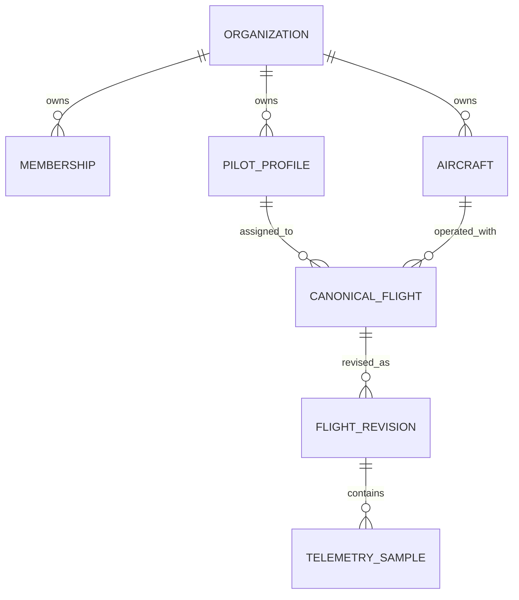

# Organization isolation

Status: draft Phase 0 proof
Last updated: 2026-07-15

## Purpose

P0-05 must make cross-organization access difficult to express and easy to test. The first executable slice translates the generic ownership and identity rules from [`DOMAIN-MODEL.md`](DOMAIN-MODEL.md) into PostgreSQL constraints, forced row-level security (RLS), and an organization-required repository boundary.

The native PostgreSQL spike lives in [`../../spikes/postgres-rls/`](../../spikes/postgres-rls/). It validates PostgreSQL as a viable relational isolation mechanism without yet accepting D-002 or selecting Drizzle, pg-boss, a database host, or a production administration model.

## Relational ownership slice

The proof includes the smallest connected resource graph needed to exercise the canonical model:



Every child has a non-null `organization_id`. Parent keys and foreign keys include that organization identifier, so a Beta flight cannot reference an Alpha pilot, aircraft, revision, or telemetry parent even if an application mutation supplies exact resource IDs. This relational slice persists generic flight facts and capability names; source-specific parser structures remain outside it.

The full canonical schema still validates provenance, effective facts, sample counts, and fingerprint integrity before persistence. This spike does not duplicate that complete validator as database constraints.

## Roles and RLS

The migration defines two deliberately separate roles:

| Role | Use | Relevant properties |
|---|---|---|
| `droneworks_migrator` | Owns the schema and tables | `NOLOGIN`, `NOINHERIT`, non-superuser, `NOBYPASSRLS` |
| `droneworks_app` | Ordinary repository, job, and export access | login, `NOINHERIT`, non-owner, non-superuser, `NOBYPASSRLS` |

Every customer-owned table enables RLS and uses `FORCE ROW LEVEL SECURITY`, including the organization root. One policy permits a row only when its organization matches the transaction's `app.organization_id`; missing or empty context resolves to no organization and therefore no rows. The same expression is used for `USING` and `WITH CHECK`, so writes cannot move or create rows outside the selected organization.

The bootstrap superuser exists only inside the temporary test cluster to create roles, apply the migration, seed synthetic evidence, and assert the explicit bypass case. It is not an ordinary application or proposed production maintenance path.

## Pooled-connection contract

Organization context is always transaction-local:

```text
pool.connect()
  -> BEGIN
  -> set_config('app.organization_id', authorizedOrganizationId, true)
  -> repository queries
  -> COMMIT or ROLLBACK
  -> release connection
```

The third argument to `set_config` makes the setting local to the transaction. The executable pool test fixes the pool at one connection, records its backend PID, runs Alpha, releases the connection, proves a contextless read on the same PID returns zero rows, and then proves Beta sees only Beta data on that same PID.

Repository methods do not accept an optional organization filter. They can run only inside `withOrganization()`, which rejects missing/invalid context before acquiring a client. Background job lookup additionally requires both `organizationId` and the domain ID; a flight ID alone is invalid input. The organization passed here must already have been authorized by the application membership/role layer.

## Executable evidence

The integration suite currently proves, with synthetic Alpha and Beta records:

- ordinary-role attributes and table ownership;
- RLS enabled and forced on all seven tables;
- missing-context read and write denial;
- direct-ID, join, aggregate, export, and mutation isolation;
- cross-organization relationship rejection through composite foreign keys;
- transaction-safe reuse of the same pooled backend;
- fail-closed job lookup; and
- forced RLS behavior for the table owner, alongside explicit superuser bypass evidence.

Run it with native PostgreSQL 18:

```sh
npm --prefix spikes/postgres-rls test
```

The runner creates and destroys an ephemeral socket-only cluster. It does not start a persistent service or use Docker.

## Object and download boundary for the next slice

Object paths should be derived only after an organization-owned database row is authorized. The proposed shape is:

```text
organizations/{organization_id}/raw-sources/{raw_source_id}/revisions/{source_revision_id}
organizations/{organization_id}/exports/{export_id}/{artifact_id}
```

The path is defense-in-depth metadata, not authority. A download operation must select the raw-source or export row inside current organization context, recheck current membership and role, derive the object key from the authorized row, and issue a short-lived URL. A client-supplied object key or possession of an expired URL must never substitute for current authorization.

This flow remains design evidence until exercised against real object-storage artifacts and revocation behavior.

## Remaining P0-05 proof obligations

- Integrate membership and Phase 1 role authorization at an API boundary.
- Exercise the organization-required contract through a real background queue and retry path.
- Implement and negatively test object-key derivation, signed-download issuance, expiry, and membership revocation.
- Define explicit, narrow, observable production migration and maintenance access without giving ordinary processes bypass privileges.
- Confirm a reviewed migration tool preserves policies, grants, ownership, and forced RLS.
- Extend isolation tests across raw sources, imports, overrides, audit events, generated exports, cached organization-linked secrets, and deletion paths as those schemas become executable.

D-002 remains proposed until the non-relational and privileged-access obligations above are closed.
