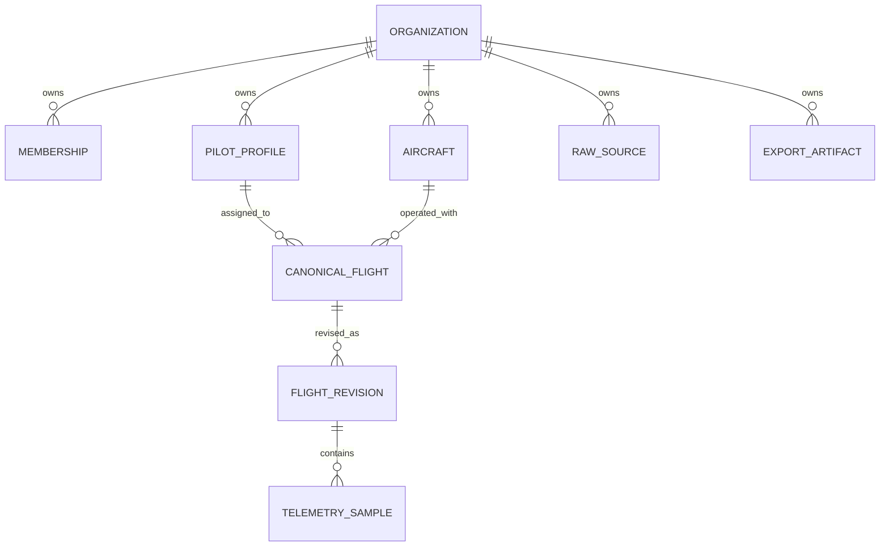

# Organization isolation

Status: draft Phase 0 proof
Last updated: 2026-07-15

## Purpose

P0-05 must make cross-organization access difficult to express and easy to test. The first executable slice translates the generic ownership and identity rules from [`DOMAIN-MODEL.md`](DOMAIN-MODEL.md) into PostgreSQL constraints, forced row-level security (RLS), and an organization-required repository boundary.

The native PostgreSQL spike lives in [`../../spikes/postgres-rls/`](../../spikes/postgres-rls/). It validates PostgreSQL as a viable relational isolation mechanism and exercises pg-boss as the provisional real-queue candidate without yet accepting D-002 or selecting Drizzle, pg-boss, a database host, or a production administration model.

## Relational ownership slice

The proof includes the smallest connected resource graph needed to exercise the canonical model:



Every child has a non-null `organization_id`. Parent keys and foreign keys include that organization identifier, so a Beta flight cannot reference an Alpha pilot, aircraft, revision, or telemetry parent even if an application mutation supplies exact resource IDs. Raw-source and export-artifact references are also organization-owned RLS rows; their physical object keys are derived only after authorization and are not accepted as client input. This relational slice persists generic flight facts and capability names; source-specific parser structures remain outside it.

The full canonical schema still validates provenance, effective facts, sample counts, and fingerprint integrity before persistence. This spike does not duplicate that complete validator as database constraints.

## Roles and RLS

The migration defines three deliberately separate roles:

| Role | Use | Relevant properties |
|---|---|---|
| `droneworks_migrator` | Owns the schema and tables | `NOLOGIN`, `NOINHERIT`, non-superuser, `NOBYPASSRLS` |
| `droneworks_app` | Ordinary repository, job, and export access | login, `NOINHERIT`, non-owner, non-superuser, `NOBYPASSRLS` |
| `droneworks_queue` | Owns only the pg-boss infrastructure schema | login, `NOINHERIT`, non-superuser, `NOBYPASSRLS`; no customer-table grants |

Every customer-owned table enables RLS and uses `FORCE ROW LEVEL SECURITY`, including the organization root. One policy permits a row only when its organization matches the transaction's `app.organization_id`; missing or empty context resolves to no organization and therefore no rows. The same expression is used for `USING` and `WITH CHECK`, so writes cannot move or create rows outside the selected organization.

The bootstrap superuser exists only inside the temporary test cluster to create roles, apply the migration, seed synthetic evidence, and assert the explicit bypass case. It is not an ordinary application or proposed production maintenance path.

## Pooled-connection contract

Organization context is always transaction-local:

```text
pool.connect()
  -> BEGIN
  -> set_config('app.organization_id', authorizedOrganizationId, true)
  -> repository queries
  -> COMMIT or ROLLBACK
  -> release connection
```

The third argument to `set_config` makes the setting local to the transaction. The executable pool test fixes the pool at one connection, records its backend PID, runs Alpha, releases the connection, proves a contextless read on the same PID returns zero rows, and then proves Beta sees only Beta data on that same PID.

Repository methods do not accept an optional organization filter. They can run only inside `withOrganization()`, which rejects missing/invalid context before acquiring a client. Background job enqueue and execution both require the exact versioned payload `{ schemaVersion, organizationId, flightId }`; a flight ID alone or additional private material is invalid. The queue role owns only pg-boss infrastructure, while the worker resolves domain rows through the ordinary RLS application pool. The organization passed here must already have been authorized by the application membership/role layer.

## Executable evidence

The integration suite currently proves, with synthetic Alpha and Beta records:

- ordinary-role attributes and table ownership;
- RLS enabled and forced on all nine tables;
- missing-context read and write denial;
- direct-ID, join, aggregate, export, and mutation isolation;
- cross-organization relationship rejection through composite foreign keys;
- transaction-safe reuse of the same pooled backend;
- fail-closed job lookup, durable payload validation before enqueue and execution, and real queue retry isolation;
- organization-derived raw-source/export keys, bounded link lifetime, uniform denial, and membership-revocation checks; and
- forced RLS behavior for the table owner, alongside explicit superuser bypass evidence.

Run it with native PostgreSQL 18:

```sh
npm --prefix spikes/postgres-rls test
```

The runner creates and destroys an ephemeral socket-only cluster. It does not start a persistent service or use Docker.

## Background queue boundary

The pg-boss proof keeps queue infrastructure and customer data permissions separate. A dedicated `droneworks_queue` role owns only the `droneworks_jobs` schema. Durable flight-refresh jobs contain only a payload version, organization ID, and flight ID; raw sources, coordinates, parser results, cached secrets, and user authorization material are rejected as unexpected fields.

The test fails an Alpha job once, lets pg-boss place the same job into retry state, and then succeeds it. Both attempts load only Alpha through the one-connection RLS pool. A Beta-scoped job containing the Alpha flight ID completes with `not_found` and never reaches the domain handler. A malformed ID-only job inserted by bypassing the enqueue adapter is rejected again during execution and reaches terminal failed state. This proves the organization contract survives durable storage, connection reuse, and retry; it does not imply exactly-once domain effects, so handlers must remain idempotent.

## Object and download boundary

Object paths are derived only after an organization-owned database row is authorized. The executable shape is:

```text
organizations/{organization_id}/raw-sources/{raw_source_id}/revisions/{source_revision_id}
organizations/{organization_id}/exports/{export_id}/{artifact_id}
```

The path is defense-in-depth metadata, not authority. The executable boundary selects the raw-source or export row inside current organization context, joins the current membership, requires the first owner/admin role subset, derives and escapes every object-key segment from the authorized row, and calls an injected signer with a maximum 15-minute lifetime. Client-supplied object keys are rejected. Missing, cross-organization, viewer, deleted, expired, revoked, and unknown resources return one indistinguishable `download_not_found` denial and never invoke the signer.

The authorization query holds a row lock on the membership and artifact until signing completes. The revocation test proves a previously authorized one-second link expires and that the removed admin cannot mint a replacement. The signer is deliberately a deterministic test adapter: real object-storage URL expiry, provider-side object access, deletion, and revocation still require production-shaped evidence.

## Remaining P0-05 proof obligations

- Integrate the complete Phase 1 membership/role matrix, including pilot-own-flight raw/export scope, at an API boundary.
- Exercise worker termination, cancellation, queue-age observability, and idempotent domain mutation under retry before accepting pg-boss.
- Exercise object-key derivation, URL expiry, membership revocation, and deletion against real object-storage artifacts rather than the signer adapter alone.
- Define explicit, narrow, observable production migration and maintenance access without giving ordinary processes bypass privileges.
- Confirm a reviewed migration tool preserves policies, grants, ownership, and forced RLS.
- Extend isolation tests across imports, overrides, audit events, cached organization-linked secrets, and deletion paths as those schemas become executable.

D-002 remains proposed until the non-relational and privileged-access obligations above are closed.
