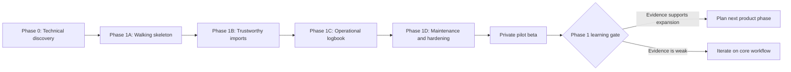

# Drone.Works delivery plan

Status: accepted
Owner: product and engineering
Last updated: 2026-07-20

## Purpose

This plan turns the Phase 1 product contract into small, evidence-gated delivery increments. It intentionally avoids a complete feature backlog before the highest-risk assumptions have been tested.

The plan is governed by:

- [`../product/PRODUCT.md`](../product/PRODUCT.md)
- [`../product/BEHAVIOR.md`](../product/BEHAVIOR.md)
- [`../product/PHASE-1-ACCEPTANCE.md`](../product/PHASE-1-ACCEPTANCE.md)
- [`../product/DECISIONS.md`](../product/DECISIONS.md)

## Planning principles

1. Prove risky assumptions before optimizing delivery speed.
2. Build vertical slices that users can exercise end to end.
3. Treat organization isolation, provenance, and deletion as architecture—not final hardening.
4. Keep the supported DJI matrix narrow and truthful.
5. Create detailed tasks only for the current and next delivery increment.
6. Do not begin a later increment merely because earlier code exists; satisfy its exit gate.

## Delivery sequence

D-016 temporarily holds A14 and hosted rollout while product behavior advances
through local-only, evidence-gated slices. The phase outcomes below are
unchanged; [`LOCAL-PRODUCT-BACKLOG.md`](LOCAL-PRODUCT-BACKLOG.md) is the active
implementation sequence until the product owner accepts the local workflow.
LP01 and LP02 are complete in that local sequence; LP03 is the next bounded
slice. This evidence does not pass the broader Phase 1B exit gate.

Durations are estimated only after Phase 0 establishes the stack and technical constraints. Outcome gates take precedence over calendar targets.

## Phase 0 — Technical discovery

### Outcome

The team can begin the production walking skeleton without guessing about DJI feasibility, canonical data shape, organization isolation, telemetry storage, or the deployment model.

### Scope

- Legal and technical DJI fixture acquisition.
- Parser, encryption/key retrieval, and failure-isolation evaluation.
- Canonical flight and provenance model draft.
- Organization-isolation proof.
- Telemetry storage and downsampling benchmark.
- Stack, authentication, job, object-storage, and deployment decisions.
- Initial threat model and cost envelope.
- Phase 1A implementation backlog.

Detailed work and exit criteria are defined in [`PHASE-0-DISCOVERY.md`](PHASE-0-DISCOVERY.md).

The implementation-ready next increment is in
[`PHASE-1A-BACKLOG.md`](PHASE-1A-BACKLOG.md), with the bounded
[`PHASE-1B-OUTLINE.md`](PHASE-1B-OUTLINE.md) and active
[`RISK-REGISTER.md`](RISK-REGISTER.md).

### Exit gate

- Every Phase 0 blocking decision is accepted or explicitly deferred with a safe temporary boundary.
- At least one legally obtained supported DJI log completes the candidate parse-and-normalize path.
- Corrupt or unsupported input fails independently with a structured reason.
- The organization-isolation approach has an executable proof covering a cross-tenant negative case.
- Telemetry benchmark evidence supports a provisional storage choice and cost estimate.
- Phase 1A tasks are small enough to implement and verify independently.

Exit review: passed on 2026-07-16 with safe external enablement gates documented
in [`PHASE-0-EXIT-REVIEW.md`](PHASE-0-EXIT-REVIEW.md). Phase 1A may begin at A01;
hosted customer data and production DJI retrieval remain disabled until their
named tasks pass.

## Phase 1A — Walking skeleton

### User-visible outcome

An authorized user creates or enters an organization, uploads one supported DJI log, observes asynchronous processing, and opens a flight summary with a 2D track.

### Included

- Production repository/application skeleton and repeatable local environment.
- Continuous integration for formatting, static checks, tests, and build.
- Web-session authentication and one selected organization context.
- Minimum owner membership, pilot profile, aircraft, import source, import item, flight, and telemetry resources.
- Organization isolation in application and persistence boundaries.
- Immutable raw upload to object storage.
- One explicitly supported DJI log variant.
- Asynchronous parse-and-normalize job.
- Import status and actionable failure reason.
- Flight summary API and minimal web page with a 2D track.
- Structured logs, request correlation, and basic job observability.

D-015 sequences this work through a generated local/test-only identity first.
The functional local application must pass before Better Auth integration, but
that intermediate gate is not an authenticated or releasable Phase 1A outcome.
Verified web sessions and the repeated end-to-end path remain mandatory before
any AWS staging deployment.

### Excluded

- Batch upload UI.
- Reconciliation UI.
- Probable duplicate review.
- Full telemetry chart suite.
- Manual entry, exports, maintenance, billing, and public integrations.

### Exit gate

- The vertical path passes in a clean local environment and a deployed non-production environment.
- The supported fixture and a corrupt fixture exercise success and isolated failure paths.
- Cross-organization access is denied at API and persistence boundaries.
- Re-uploading the same file does not create a second canonical flight.
- Removing a test organization removes its database and object-storage payload from the non-production environment.
- Operational instructions explain deployment, rollback, job retry, and log inspection.

## Phase 1B — Trustworthy imports

### User-visible outcome

A team can upload a real batch and understand or resolve every file outcome without silent data loss.

### Included

- Batch and per-file progress.
- Content-based format detection.
- Supported-format matrix surfaced in documentation and product UI.
- Exact-file and exact-normalized duplicate handling.
- Probable-duplicate review without automatic discard.
- Aircraft, battery, pilot, and timezone reconciliation.
- Multi-battery association and unknown battery behavior.
- Processing attempts and safe retry.
- Reprocessing revisions with user-override preservation.
- Parser resource isolation and structured failure taxonomy.
- Import usability testing with representative operators.

### Exit gate

- All import, duplicate, timezone, and multi-battery scenarios in the Phase 1 acceptance specification pass for implemented behavior.
- Supported valid fixtures meet the current completion target.
- Unsupported, corrupt, truncated, and encryption/key failures are distinguishable.
- A failed file cannot interrupt other items in its batch.
- Review decisions and automated match reasons are auditable.
- Users unfamiliar with the implementation can explain every result in a usability session.

## Phase 1C — Operational logbook

### User-visible outcome

A team can use Drone.Works as its daily flight record: inspect, correct, search, replay, enter, and export flights.

### Included

- Pilot, aircraft, and battery registries.
- Flight and fleet lists with agreed filters.
- Tags, notes, assignments, and scoped bulk actions.
- Manual flight entry.
- Flight detail with synchronized map and essential charts.
- Capability-aware missing-data behavior.
- Extrema-preserving downsampling and bounded full telemetry access.
- Imported, derived, and overridden field presentation.
- Derived pilot, aircraft, battery, and dashboard totals.
- Flight deletion and restoration.
- CSV/JSON flight and filtered-set exports.
- GPX/KML track exports when coordinates exist.
- Phase 1 role matrix across UI and API.

### Exit gate

- Relevant acceptance scenarios pass at API and UI boundaries.
- Reassignment, correction, deletion, restoration, and reprocessing keep totals consistent.
- The primary flight page meets its defined reference performance target.
- Exports are documented and round-trip checked against canonical records.
- No capability panel represents missing measurements as zero.

## Phase 1D — Basic maintenance and release hardening

### User-visible outcome

The customer can act on basic aircraft maintenance state and trust the product's operational, privacy, and recovery behavior.

### Included

- Aircraft flight-hours, flight-count, and one-shot maintenance schedules.
- Maintenance completion and recurring baselines.
- Due-soon and overdue calculation.
- Organization policy for assignment blocking.
- Explainable aircraft assignment eligibility.
- Complete organization export.
- Organization deletion grace period and permanent deletion workflow.
- Audit coverage for domain mutations.
- Backup-retention and deletion-verification procedures.
- Security review, dependency review, performance test, accessibility pass, and recovery exercise.
- Production monitoring, alerting, runbooks, and support workflow.

### Exit gate

- All Phase 1 acceptance scenarios pass or an explicit exception is accepted in the decision log.
- Maintenance recalculates correctly after historical flight changes.
- Role and organization-isolation tests cover every customer-owned resource.
- Deletion is verified across the database, object storage, generated exports, logs, and backup lifecycle.
- Restore and rollback procedures have been exercised.
- Known limitations and the supported DJI matrix are customer-visible.

## Private pilot beta

### Outcome

Real operators validate that Drone.Works is more trustworthy and understandable than their current flight-record workflow.

### Entry conditions

- Phase 1D exit gate is satisfied.
- Pilot organizations sign appropriate terms and understand the product is pre-release.
- Support, incident, backup, and data-deletion processes have named owners.
- No customer is asked to provide a flight log without clear consent and handling terms.

### Learning period

Use the product with at least five pilot organizations for four consecutive weeks. Observe onboarding, import completion, review frequency, correction patterns, support requests, and whether the product becomes the primary flight record.

### Phase 1 learning gate

Expansion beyond the core workflow requires the success evidence in `PRODUCT.md`. If evidence is weak, improve import coverage, clarity, reliability, or daily-logbook usability before adding compliance, missions, or marketplace features.

## Backlog policy

- Maintain implementation-ready tasks only for the current increment and the immediately following increment.
- Capture later ideas as short outcome statements, not fully estimated stories.
- Each implementation task must state outcome, scope, non-goals, acceptance criteria, dependencies, verification, and affected contract documents.
- A task cannot close solely because code was written; its verification evidence must be recorded.
- Security, privacy, migration, and operational work belong inside the relevant increment rather than in a final generic hardening bucket.

## Change control

- Product-scope changes update `PRODUCT.md` and this plan.
- Observable behavior changes update `BEHAVIOR.md` and the acceptance specification.
- Technical commitments are accepted or superseded in `DECISIONS.md`.
- Dates may change without a product-contract update; outcomes and gates may not.
