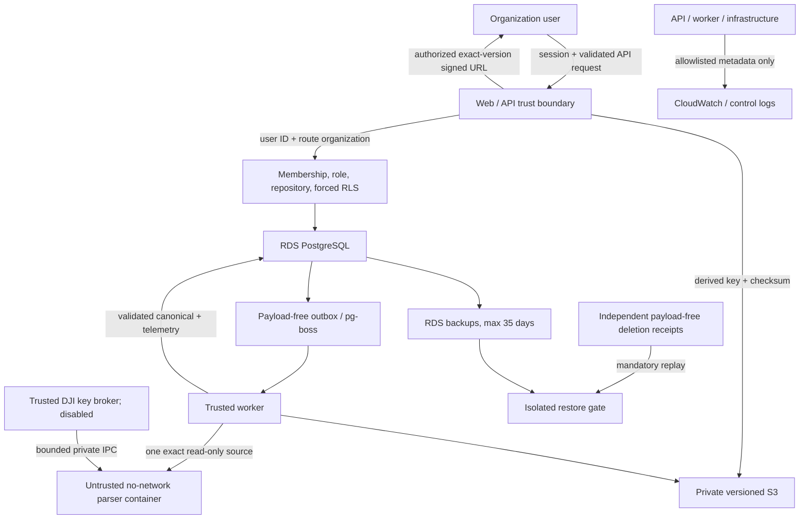

# Phase 1A threat model and privacy flow

Status: accepted Phase 0 baseline
Last updated: 2026-07-16
Scope: organization → upload → asynchronous parse → canonical flight → 2D track

## Method and rating

This model combines trust-boundary/data-flow review with STRIDE-style abuse
cases. Severity considers customer harm first: cross-organization disclosure,
credential/keychain exposure, deletion failure, or parser escape is
`critical`; material account takeover, broad data loss, or sustained service
loss is `high`. A critical/high risk must have a Phase 1A prevention or
detection control and objective verification before its boundary is enabled.

This is an engineering threat model, not legal advice or a privacy policy. DJI
terms, customer notices/consent, data-processing terms, retention disclosures,
incident-notification duties, and UAE/other jurisdiction requirements require
qualified review before production commitments.

## Actors and assets

Actors are organization owners, admins, pilots, viewers, unauthenticated users,
invited users, Drone.Works operators, CI/release identities, AWS services, email
and map providers, and the separately gated DJI key service. Adversaries include
a malicious member, compromised account, Internet attacker, malicious uploaded
file, compromised dependency/image, leaked signed link, and mistaken or abusive
operator.

Highest-value assets are customer separation, auth and cloud credentials, raw
logs, coordinates/telemetry, pilot identity, fleet serials, exports, cached DJI
keychains, deletion state/receipts, signing keys, database integrity, and
evidence that imported/derived/overridden values remain distinguishable.

## Data flow and trust boundaries

The browser is untrusted. Authentication establishes identity only; canonical
membership and RLS establish organization access. The worker is trusted with
scoped customer data, while the parser is treated as hostile. S3 signed URLs are
bearer capabilities with short lifetimes. Logs/metrics, backups, external email,
map tiles, and DJI are separate disclosure boundaries.

## Sensitive data inventory

| Data class | Customer purpose / accountable owner | Storage and retention | Access boundary | Deletion path |
|---|---|---|---|---|
| Credentials, OAuth accounts, password verifiers | user authentication; identity/security owner | Better Auth PostgreSQL tables; sessions expire/revoke | auth service and narrow callbacks only | account workflow removes/revokes after last-owner checks; backups expire ≤35 days |
| Sessions, recovery/invitation tokens | authenticate or complete one bounded action | hashed/opaque auth or domain records; short explicit expiry | token holder plus auth/domain service; never logs | consume/revoke/expire, account or org deletion, then backup expiry |
| Raw flight logs | customer source evidence; organization owner | exact versioned S3 object while legitimately referenced | role/current-membership check then short signed exact-version GET | last-reference or org deletion enumerates all versions and verifies absence |
| Coordinates and full telemetry | replay, analysis, export; organization owner | versioned per-flight S3 object plus bounded PostgreSQL metadata | organization members per role; never sent to map-tile provider | flight/org permanent deletion, all versions, backup expiry for metadata |
| Canonical flights, provenance, overrides | trustworthy operational record; organization owner | forced-RLS PostgreSQL, active until deletion lifecycle | `/api/v1/`, organization repository, role matrix | after 30-day grace; payload removed, receipt retained without payload |
| Pilot identity and membership | assignment and authorization; organization owner | forced-RLS domain tables; auth user separate | managers for membership; members for operational profile as specified | membership removal unlinks login; historical pilot remains; org deletion removes payload |
| Fleet names and serials | asset reconciliation/maintenance; organization owner | forced-RLS PostgreSQL | current organization members per role | asset/org deletion plus backup expiry |
| Generated exports and signed URLs | portability; organization owner | versioned S3 with short artifact lifetime; URL ≤15 minutes | owner/admin or permitted pilot-own scope | artifact expiry/org deletion removes all versions; URL naturally expires |
| Audit/action metadata | accountability; organization and operations owners | forced-RLS audit plus payload-free operational ledger | authorized managers or operators by purpose | customer payload forbidden; org payload removed, minimal action evidence follows retention |
| Queue/outbox references | reliable background processing; operations owner | PostgreSQL IDs/version only | app enqueue, dispatcher lease, worker scoped reload | completed/cancelled retention policy; org payload is never embedded |
| DJI request/keychain/cache | decode encrypted authorized source; organization owner | disabled; future authenticated ciphertext bound to org/source/parser/version | trusted broker only; parser gets ephemeral private IPC, no API credential | source/org deletion removes ciphertext; plaintext destroyed after child; backups ≤35 days |
| Observability/security events | operate, detect abuse/incidents; engineering/security owner | CloudWatch 30 days app / 90 days control | least-privilege operators | automatic expiry; customer payload is forbidden at creation |
| Deletion receipts | prevent resurrection and prove timing; deletion owner | separate ledger/export for 45 days after backup deadline | deletion/recovery roles | payload-free receipt expires after every applicable backup expires |
| Backups | recovery; engineering owner | encrypted RDS automated backups ≤35 days | isolated recovery role, never direct customer access | provider expiry; every restore replays deletion receipts before exposure |

## Critical and high threats

| ID | Severity | Threat / impact | Required prevention | Detection and verification | Owner |
|---|---|---|---|---|---|
| T-01 | Critical | Cross-organization read/write through IDOR, forgotten filter, join, aggregate, export, job, or pool context | route org + canonical membership/role + organization-required repositories + composite keys + non-owner forced RLS + transaction-local context | Alpha/Beta negative matrix at API/repository/job/export/download/deletion; contextless pool reads zero; alert on isolation test regression | domain/database owner |
| T-02 | Critical | Provider active-org or role claim elevates access | identity adapter emits only session/user IDs; domain memberships/roles authoritative | forged owner and wrong-active-org tests; session revocation test | auth owner |
| T-03 | Critical | Malicious parser input escapes, reads credentials, or exhausts host | fresh unprivileged rootless container, no network, no host IAM/DB socket, read-only source, dropped capabilities, CPU/memory/PID/time/output/tmp limits | valid parse after poison/panic, resource-kill classifications, Linux containment tests, image/SBOM attestation | parser/platform owner |
| T-04 | Critical | DJI credential, keychain, feature points, or provider payload leaks | provider disabled; trusted broker only; managed secret; allowlisted endpoint; redirect/size/time limits; ephemeral IPC; encrypted scoped cache; strict log denylist | mock-provider redirect/timeout/size/redaction suite; secret scan; access alarms; D-012 approval | key-service/security owner |
| T-05 | Critical | Permanent deletion leaves S3 versions or restore resurrects customer | enumerate/delete exact versions/relist; active DB deletion; 35-day backup max; independent receipt replay before restore exposure | object conformance test, deletion backlog/deadline alarm, quarterly restore/replay drill, zero active rows/versions | deletion/recovery owner |
| T-06 | Critical | Migration/operator privilege bypasses RLS or modifies audit evidence | separate non-inheriting migration role, no-login owners, checksum-pinned SQL, advisory lock, independent ledger, no ordinary table grants | isolation-contract digest, role/grant tests, CloudTrail, break-glass alert | database/security owner |
| T-07 | High | Leaked or guessed signed URL exposes raw/export data | unguessable HTTPS signature, exact version, ≤15-minute expiry, `private,no-store`, authorize on mint, no public bucket/list | expiry/tamper/deleted-version tests, S3 access anomaly, no URL query logging | API/storage owner |
| T-08 | High | Account takeover, invite theft, recovery abuse, session fixation, or CSRF | verified email, single-use expiring invite/recovery tokens, secure HttpOnly SameSite cookie, origin/CSRF checks, redirect allowlist, rate limits, revoke on security events | real Better Auth hosted integration suite, auth rate/anomaly metrics, owner notification | auth owner |
| T-09 | High | Queue replay, duplicate delivery, confused org, or cancelled job changes data | payload version+org+domain ID only, strict validation twice, RLS reload, idempotent handlers, atomic outbox, stable queue UUID, lease tokens | retry/crash/cancel/stale-token tests; queue age/retry/dead-letter alerts | jobs/domain owner |
| T-10 | High | Object key confusion, overwrite, checksum substitution, or cross-org purge | keys derived after authorization; encoded segments; conditional create; SHA-256 confirmation; stored exact version; prefix-scoped IAM | collision/checksum/cross-prefix tests and live temporary-bucket conformance | storage owner |
| T-11 | High | Logs, traces, errors, support tools, or analytics leak customer payload | structured field allowlist; no bodies/SQL params/free-form provider errors; pseudonymous org metric only; no routine direct support access | redaction tests/canaries, field-budget alerts, review sample, 30/90-day expiry | observability/security owner |
| T-12 | High | Compromised package, parser source, CI identity, or OCI image ships malicious code | exact locks, source hash, SBOM/licenses/advisories, isolated build, short-lived CI identity, signed attestations, digest promotion, protected review | verify signature/SBOM before deploy; dependency alerts; reproducible parser build comparison | release/security owner |
| T-13 | High | XSS or malicious filename/content executes in browser | contextual escaping, CSP, no unsafe HTML, attachment+nosniff downloads, sanitized display filename, JSON schemas | browser security tests, CSP reports, dependency scan | web owner |
| T-14 | High | SSRF or unrestricted egress exfiltrates S3/metadata/secrets | parser no-network; key broker exact host/path and no redirects; workload IAM; instance metadata v2/hop limit; explicit outbound destinations | provider mock tests, VPC/control logs, unexpected destination alert | platform/security owner |
| T-15 | High | Availability/cost attack through uploads, parsing, exports, auth, or object versions | per-user/org quotas, bounded batch/body/object size, rate limits, parser concurrency/resource caps, idempotency, lifecycle cleanup, budget alarms | rejection/latency/queue/object-version/cost metrics; synthetic overload test | platform/product owner |
| T-16 | High | Map/geocode provider learns private route | flight coordinates never enter tile/style request; provider adapter accepts viewport/style only; no referrer query payload | browser network assertion with representative route; CSP connect allowlist | web/privacy owner |
| T-17 | High | Data corruption hides provenance, duplicate ambiguity, or manual override | immutable raw source, revisioned processing, imported/derived/override separation, deterministic fingerprints, never silently discard probable duplicates | lifecycle/model regression suite and audit events without payload | domain owner |

## Medium risks and baseline controls

- Email metadata necessarily reaches the selected transactional provider; send
  only the destination, template variables required for the message, and an
  opaque action URL. Contract/region/retention review precedes selection.
- S3/RDS regional outage can exceed beta objectives. The private beta accepts
  one region and Single-AZ RDS until drills, customer commitments, or availability
  requirements trigger Multi-AZ/multiple hosts.
- Traffic analysis and timing may reveal activity. Uniform not-found behavior,
  bounded operations, and no cross-org counts reduce inference; perfect timing
  equality is not claimed.
- A malicious organization owner can export data they legitimately control.
  Reauthentication, audit, short links, and rate limits reduce accidental or
  stolen-session abuse; product policy determines owner authority.
- Browser extensions or a compromised customer device can access what the user
  can see. Short sessions/links, CSP, secure cookies, and audit reduce exposure;
  endpoint security remains outside Drone.Works control.

## Privacy principles embedded in Phase 1A

- collect only data required for the accepted product scope;
- keep pilot profiles separate from login identity;
- never use customer flight data as casual development fixtures;
- keep imported facts, derived values, and user overrides distinguishable;
- do not send routes to tile providers or telemetry to observability providers;
- provide complete exports and enforce active deletion plus a disclosed maximum
  backup window; and
- keep optional external processing disabled until authority, notice, consent,
  retention, and deletion are approved.

## Residual and externally gated risks

The Phase 0 evidence cannot prove live AWS policy/KMS/S3 behavior, production
Better Auth cookies/email, actual restore timing, a chosen map/email provider, or
legal authority for DJI processing without external accounts, credentials,
cost, and review. These do not authorize a shortcut. The security checklist
keeps hosted customer data, the affected provider, or the affected feature
disabled until its gate passes.

